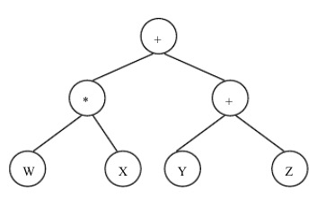
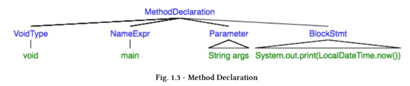
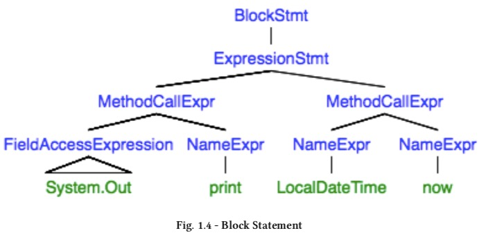
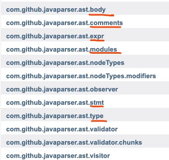

# day_1


## 搭建环境

```
<!--添加到依赖里-->
<dependency>
  <groupId>com.github.javaparser</groupId>
  <artifactId>javaparser-symbol-solver-core</artifactId>
  <version>3.13.3</version>
</dependency>
```


## AST

**简单的说。**

首先什么是抽象语法🌲，我的理解就是把代码按照语法结构，抽象成数据，这种数据结构是一个树。

W*X+(Y+Z)，可以分成 W\*X 、+、Y+Z。

W\*X，分成 W、*、X。

Y+Z，分为 Y、+、Z。

这样一个式子被分解成为一棵树。



当计算的时候，从根回溯，先算(W * X) 的值 、（Y+Z）的值，然后用父节点的运算符算两者的值。就是学数据结构的时候，通过树的后续遍历去计算树的结果。这样就是一个简单的式子的AST。


##在JAVAPARSER:VISITED代码示例

```java
package com.github.javaparser;
import java.time.LocalDateTime

//这本书中A Brief Introduction to Abstract Syntax Trees中
public class TimePrinter {
    public static void main(String[] args) {
        System.out.println(LocalDateTime.now());
    }
}
```

​     
​		
​							             👆的代码首先被解析成👇
​		
​		


​		

上面的代码解析成了一棵根叫做CompilationUnit(编译单元)的树，他有三个子节点：PackageDeclaration、SingleTypeImportDeclaration、ClassOrInterfaceDeclaration。

代码首先被分类成了个节点:包的声名、单一类型的引用的声明、类或者接口的声明。

​		

- PackageDeclaration的子节点是一个QualifiedNameExpr(限定名表达式)，也就可以说PackageDeclaration该节点是由一个QualifiedNameExpr节点。

  什么是限定名表达式，百度了一下：如java.lang.String就是类String的全限定类名，String就是该类的非限定类名，即全限定类名是带上包路径定位一个类。

  所以从这个来看，对于语言使用上，虽然早已经很熟悉了，但是从代码结构上定义，其实还并不清楚。

- SingleTypeImportDeclaration包括一个ClassOrInterfaceType节点，该节点表示类或者接口类型，即所引用的java.time.LocalDateTime类型。


- ClassOrInterfaceDeclaration的子节点有两个NameExpr、MethodDeclaration。

  ​	NameExpr，名字表达式是该类的名字。

  ​	MethodDeclaration类中的方法声明。


  ​	

​		




​		

第三部分MethodDeclaration，展开后，又由上述节点组成。

- VoidType、NameExpr、Parameter这些节点用来描述函数的空返回值、名字、参数。


- BlockStmt表示的函数块里的内容。


  ​	

​		




​		

第四部分BlockStmt细分为ExpressionStmt，表达式语句。然后再一层层继续细化为再不可细分的语法结构。

​		

那这些节点到底是怎么分类的呢？

从[文档](https://www.javadoc.io/static/com.github.javaparser/javaparser-core/3.0.0-alpha.10/overview-summary.html)中package的组织中看出，有下面这些结构:



​			

| 类型       |                                |
| -------- | ------------------------------ |
| body     | 主要是一些声明定义，如类的定义                |
| comments | 注视                             |
| expr     | 表达式                            |
| modules  | 模块                             |
| stmt     | 声明语句:return、try/catch、for、do等等 |
| type     | 类型:数组、类、空类型等                   |

​		

##参考

[javadoc](https://www.javadoc.io/doc/com.github.javaparser/javaparser-core/latest/index.html)

[javaparser:visited](https://leanpub.com/javaparservisited)