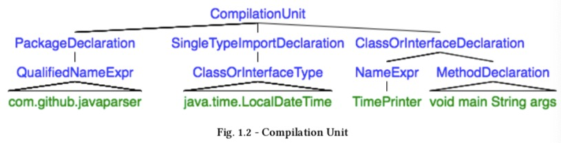

# day_2

有了AST，怎么去操作这棵树？

# 添加依赖

```java
<!--因为不同版本的包在使用上有不太一样的地方，具体版本具体对应，以下分析代码用该依赖-->
<dependency>
   <groupId>com.github.javaparser</groupId>
   <artifactId>javaparser-core</artifactId>
   <version>3.0.0-alpha.8</version>
</dependency>
```

# 示例

遍历AST树中的节点，包中给的是一个visitor模式(java的一种设计模式)，对于设计模式了解较少，学习了一下，visitor正好适合像AST这种数据结构不变，但操作多变的情况。

以下要分析的代码:

```java
//SampleOne.java
package com.github.javaparser;
import java.time.LocalDateTime;

public class TimePrinter {
    public static void main(String[] args) {
        System.out.println(LocalDateTime.now());
    }
}
```




首先我们先遍历AST中PackageDeclaration、SingleTypeImportDeclaration、ClassOrInterfaceDeclaration这三类节点。

```
import com.github.javaparser.JavaParser;
import com.github.javaparser.ast.CompilationUnit;
import com.github.javaparser.ast.PackageDeclaration;
import com.github.javaparser.ast.body.ClassOrInterfaceDeclaration;
import com.github.javaparser.ast.imports.SingleTypeImportDeclaration;
import com.github.javaparser.ast.visitor.VoidVisitorAdapter;

import java.io.File;

public class Test {
    static final String FILE_PATH = "SampleOne.java";

    public static void main(String[] args) throws Exception{

        CompilationUnit cu = JavaParser.parse(new File(FILE_PATH));

        VoidVisitorAdapter<Object>  visitor = new VoidVisitorAdapter<Object>() {
            @Override
            public void visit(PackageDeclaration n, Object arg) {
                super.visit(n, arg);
                System.out.println("[PackageDeclaration]:\n"+n.toString());
            }

            @Override
            public void visit(SingleTypeImportDeclaration n, Object arg) {
                super.visit(n, arg);
                System.out.println("[SingleTypeImportDeclaration]:\n"+n.toString());
            }

            @Override
            public void visit(ClassOrInterfaceDeclaration n,Object arg){
                super.visit(n,arg);
                System.out.println("[ClassOrInterfaceDeclaration]:\n"+n.toString());
            }
        };
        cu.accept(visitor,null);
    }
}
```

输出了下面的三个节点(visitor会遍历所有AST的重写visit对应类型节点，并不是按层遍历):

```java
[PackageDeclaration]:
package com.github.javaparser;


[SingleTypeImportDeclaration]:
import java.time.LocalDateTime;

[ClassOrInterfaceDeclaration]:
public class TimePrinter {

    public static void main(String[] args) {
        System.out.println(LocalDateTime.now());
    }
}
```

​		

​		

我们可以在上面的遍历ClassOrInterfaceDeclaration对应的子树中的NameExpr、MethodDeclaration类型的节点。

```java
import com.github.javaparser.JavaParser;
import com.github.javaparser.ast.CompilationUnit;
import com.github.javaparser.ast.PackageDeclaration;
import com.github.javaparser.ast.body.ClassOrInterfaceDeclaration;
import com.github.javaparser.ast.body.MethodDeclaration;
import com.github.javaparser.ast.expr.NameExpr;
import com.github.javaparser.ast.imports.SingleTypeImportDeclaration;
import com.github.javaparser.ast.visitor.VoidVisitorAdapter;

import java.io.File;

public class Test {
    static final String FILE_PATH = "SampleOne.java";

    public static void main(String[] args) throws Exception{

        CompilationUnit cu = JavaParser.parse(new File(FILE_PATH));

        VoidVisitorAdapter<Object> methodDclarationVisitor = new VoidVisitorAdapter<Object>() {
            @Override
            public void visit(MethodDeclaration n, Object arg) {
                super.visit(n, arg);
                System.out.println("--[MethodDeclaration]:\n--"+n.toString());
            }

            @Override
            public void visit(NameExpr n, Object arg){
                super.visit(n,arg);
                System.out.println("--[NameExpr]:\n--"+n.toString());
            }
        };


        VoidVisitorAdapter<Object>  visitor = new VoidVisitorAdapter<Object>() {
            @Override
            public void visit(PackageDeclaration n, Object arg) {
                super.visit(n, arg);
                //System.out.println("[PackageDeclaration]:\n"+n.toString());
            }

            @Override
            public void visit(SingleTypeImportDeclaration n, Object arg) {
                super.visit(n, arg);
                //System.out.println("[SingleTypeImportDeclaration]:\n"+n.toString());
            }

            @Override
            public void visit(ClassOrInterfaceDeclaration n,Object arg){
                super.visit(n,arg);
                n.accept(methodDclarationVisitor,null);
                System.out.println("[ClassOrInterfaceDeclaration]:\n"+n.toString());
            }
        };


        cu.accept(visitor,null);
    }
}
```

从下面的输出中可以看出NameExpr不仅仅是ClassOrInterfaceDelaration的儿子节点的TimePrinter了，还有他子树中的其他节点。其实从输出的的顺序可以看出树的遍历是后续遍历的，因为打印是从树自下而上的遍历的。

```
--[NameExpr]:
--TimePrinter
--[NameExpr]:
--main
--[NameExpr]:
--System
--[NameExpr]:
--out
--[NameExpr]:
--println
--[NameExpr]:
--LocalDateTime
--[NameExpr]:
--now
--[MethodDeclaration]:
--public static void main(String[] args) {
    System.out.println(LocalDateTime.now());
}
[ClassOrInterfaceDeclaration]:
public class TimePrinter {

    public static void main(String[] args) {
        System.out.println(LocalDateTime.now());
    }
}
```

​		

​		

然后再试一下按层遍历

```
import com.github.javaparser.JavaParser;
import com.github.javaparser.ast.CompilationUnit;
import com.github.javaparser.ast.Node;

import java.io.File;

public class Test {
    static final String FILE_PATH = "SampleOne.java";

    public static void main(String[] args) throws Exception{
        CompilationUnit cu = JavaParser.parse(new File(FILE_PATH));
        for (Node node : cu.getChildNodes()){
            System.out.println("--\n"+node.toString());
        }
    }
}
```

输出了根节点的儿子节点:

```
--
package com.github.javaparser;


--
import java.time.LocalDateTime;

--
public class TimePrinter {

    public static void main(String[] args) {
        System.out.println(LocalDateTime.now());
    }
}

```


# 参考

[visitor设计模式1](https://www.jb51.net/article/127439.htm)

[visitor设计模式2](https://www.cnblogs.com/noKing/p/9094354.html)

